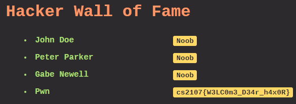

# Assignment 1

## Section A: Warm Up

### Sanity Check

It's in `CS2107 Starter Pack.pdf`.

### A.1 Hashlet (5 points)

How to find md5sum of `existence.txt`? Just use `md5sum`.

``` bash
$ md5sum existence.txt
7579ce22801161f6db141d075fb3191d  existence.txt
```

### A.2 Grep what you want (5 points)

Just use `grep` to find the file in `data here`. Then Ctrl-F for `cs2107`.

``` bash
$ grep "cs2107" *.txt
Binary file dump112.txt matches
```

### A.3 Convert Convert! (5 points)

First get the `long int` in `message.txt`.

``` bash
$ cat message.txt
Alice's message to Bob:

10473305786872614763821356815639564681414262038284397643221664232573
```

Use Python to convert to bytes. Some padding at the front.

``` Python
>>> value=10473305786872614763821356815639564681414262038284397643221664232573
>>> value.to_bytes(length=len(str(value)),byteorder='big')
b'\x00\x00\x00\x00\x00\x00\x00\x00\x00\x00\x00\x00\x00\x00\x00\x00\x00\x00\x00\x00\x00\x00\x00\x00\x00\x00\x00\x00\x00\x00\x00\x00\x00\x00\x00\x00\x00\x00\x00\x00cs2107{3Nc0d1Ng_4t_iT5_b3St}'
```

## Section B: Legit

### B.1 Password Cracking (10 points)

This challenge for `cipher.py` and `ciphertext` made use of a script written in Python, following the hints given. The script is located in `B1_gen.py`. The main code to build each key is as follows.

``` Python

# Build and pad the guessed key
currstr = preword + joiner + word
currkey = pad_key(currstr)

# Use to decrypt
try:
    done = decrypt(currkey, IV, c)
    print(currkey)
    print(done)
    return
except UnicodeDecodeError:
    continue
```
When the script is run, it will output the key and flag.

``` bash
$ python B1_gen.py
accountantblue197600000000000000
cs2107{pl5_us3_secur3_p4ssw0rd5}
```

### B.2 Dear Husband (10 points)

The private keys in `secret.txt` can be cracked with a [discrete logarithm calculator](https://www.alpertron.com.ar/DILOG.HTM).
Using fast modular exponentiation, the key is retrieved. Due to the large size of the `int`, the division operation should use a bit shift to avoid floating point error. The function can be found in `B2_dh.py`.

``` bash
$ python B2_dh.py
655926286053512778636180584709925099212
```

### B.3 Custom Protocol (10 Points)

Fairly straightforward shift cipher in `encryption_scheme` with a set random seed. Reversing the shift is all that is needed, seen in `B3_shift.py`.

``` Python
shifts = []

for i in range(len(c)):
    shifts.append(random.randint(0, len(alphabet)))

def decrypt(c):
    acc = []
    for i in range(len(c)):
        new_index = (alphabet.index(c[i]) - shifts[i]) % len(alphabet)
        acc.append(alphabet[new_index])
    return ''.join(acc)
```

### B.4 Now XOR Never (10 Points)

The big hint given is that XOR encryption is being used on `encrypted_file.png`. With a quick Google search, `xortool` in Python can be used.

``` bash
$ xortool -c 00 encrypted_file.png
The most probable key lengths:
 2:  10.7%
 4:  16.8%
 6:   9.1%
 8:  14.0%
10:   7.6%
12:  11.5%
14:   6.2%
16:   9.5%
20:   7.9%
24:   6.7%
Key-length can be 4*n
1 possible key(s) of length 4:
d0pe
Found 0 plaintexts with 95%+ valid characters
See files filename-key.csv, filename-char_used-perc_valid.csv
```
The file is output at `xortool_out/0.out`, so changing the extension to `.png` does the trick. The flag can be read in image form.

### B.5 Hacker Wall of Fame (15 Points)

Where to get the flag is seen pretty easily in the `User` class:

```PHP
public function getBadge()
{
    // Aha you shall not get the flag easily.
    if ($this->userlevel === 999) $str = getFlag();
    else $str = "Noob";
    return $str;
}
```

You just need a `User` with `userlevel` 999. However, reading through the rest of PHP code it seems everything is secure with no easy way to get the flag, but the comment in the `sign` function seems awfully suspicious.

``` PHP
function sign($str)
{
    global $secret;
    // This way of producing a signature is actually SUPER secure,
    // because nobody else would know my secret, which is like
    // 32 bytes of random characters. Try guessing that!
    return hash('sha256', $secret . $str);
}
```

It turns out, SHA-256 is still vulnerable to [Length extension attacks shown in this blog post](https://blog.skullsecurity.org/2012/everything-you-need-to-know-about-hash-length-extension-attacks), especially if we are able to control the input. Fortunately, [someone else has already made the code to do this attack, which we can use](https://github.com/iagox86/hash_extender). For the attack, we would need a string, a signature for that string, and the key length. It turns out that extending that string, and obtaining a signature for the extended string is deterministic. 

To obtain both the string and the signature we can simply open up the Developer Console > Network in Chrome. After obtaining them, just make use of the `hash_extender` to find the new Cookie. The appended code is formatted to be just like the other Users, with the level changed to 999 to be able to output the flag.

``` bash
$ ./hash_extender -d O%3A4%3A%22User%22%3A2%3A%7Bs%3A15%3A%22%00User%00userlevel%22%3Bi%3A10%3Bs%3A14%3A%22%00User%00username%22%3Bs%3A8%3A%22John+Doe%22%3B%7D%3Cx%3EO%3A4%3A%22User%22%3A2%3A%7Bs%3A15%3A%22%00User%00userlevel%22%3Bi%3A33%3Bs%3A14%3A%22%00User%00username%22%3Bs%3A12%3A%22Peter+Parker%22%3B%7D%3Cx%3EO%3A4%3A%22User%22%3A2%3A%7Bs%3A15%3A%22%00User%00userlevel%22%3Bi%3A87%3Bs%3A14%3A%22%00User%00username%22%3Bs%3A11%3A%22Gabe+Newell%22%3B%7D --data-format=html -s 458213aea4fdc24076097ded54492d19f733e9b5e16791e8957f45d337701ae9 -a %3Cx%3EO%3A4%3A%22User%22%3A2%3A%7Bs%3A15%3A%22%00User%00userlevel%22%3Bi%3A999%3Bs%3A14%3A%22%00User%00username%22%3Bs%3A3%3A%22Pwn%22%3B%7D --append-format=html -l 32 --out-data-format=html
Type: sha256
Secret length: 32
New signature: f1236bb71f441e0c7a93f8a56642a53ee6b8899d1b7ccf1f0f04baa8c191dd60
New string: O%3a4%3a%22User%22%3a2%3a%7bs%3a15%3a%22%00User%00userlevel%22%3bi%3a10%3bs%3a14%3a%22%00User%00username%22%3bs%3a8%3a%22John+Doe%22%3b%7d%3cx%3eO%3a4%3a%22User%22%3a2%3a%7bs%3a15%3a%22%00User%00userlevel%22%3bi%3a33%3bs%3a14%3a%22%00User%00username%22%3bs%3a12%3a%22Peter+Parker%22%3b%7d%3cx%3eO%3a4%3a%22User%22%3a2%3a%7bs%3a15%3a%22%00User%00userlevel%22%3bi%3a87%3bs%3a14%3a%22%00User%00username%22%3bs%3a11%3a%22Gabe+Newell%22%3b%7d%80%00%00%00%00%00%00%00%00%00%00%00%00%00%00%00%00%00%00%00%00%00%00%00%00%00%00%00%00%00%00%08%f8%3cx%3eO%3a4%3a%22User%22%3a2%3a%7bs%3a15%3a%22%00User%00userlevel%22%3bi%3a999%3bs%3a14%3a%22%00User%00username%22%3bs%3a3%3a%22Pwn%22%3b%7d
```

Copy-paste the new string and signature into a cookie editor like [EditThisCookie](https://chrome.google.com/webstore/detail/editthiscookie/fngmhnnpilhplaeedifhccceomclgfbg/related?hl=en), refresh, and the key is shown!



### B.6 Password Manager (15 Points)

"AES is very secure so there's no way people can steal my passwords." Not when ECB is being used! The same blocks of plaintext will always be encrypted to the same blocks of ciphertext, [leaving this ECB vulnerable to a Chosen Plaintext Attack](https://michael-myers.github.io/blog/post/enigma2017-broken-encryption-writeup/). 

To get the block size is simple enough - just put enough characters until the output grows once, then twice, then subtract the difference in length. In this case, the block size is 16 bytes. Then, just bruteforce and attack the next byte one-by-one as seen in `B6_ecb.py`.

Initially, I had trouble getting the next character, but I realised that the input was stripped of leading and trailing whitespace. This meant that the newline character `\n` was not processed as an actual input, so it needed to be hard-coded. Here's what the brute-force looked like.

``` Python
# bruteforce characters
for j in range(33,128):
    # add chr 1-by-1, secret required the newline character
    data = {'creds': p + secret + chr(j)}
    r = requests.post('http://ctf.nus-cs2107.com:2772/',data=data)
    soup = BeautifulSoup(r.text, 'html.parser')
    
    # retrieve new encrypted block
    enc = soup.find(id="new-creds").string[32*(k-1):32*k]

    # if new block and actual block are equal
    if enc == act:
        # then guessed char is correct, add to string
        secret += chr(j)
        if chr(j) == '}':
            return secret
        print("chr",j, chr(j))
        break
```

`secret` is used to build the prepended string, and eventually found the flag.

``` bash
$ python .\B6_ecb.py
coursemology:cs2107:cs2107{pl5_p15_p1s_d0n7_u5e_ec8}
```

Good advice.

### B.7 Password Manager v2 (15 Points)

Another password manager, another vulnerability. This time, it's clearly got to do with the Padding Oracle Attack, since the description talks about padding, and since it was covered in Lecture. Broken using `B7_cbc.py`.

Given to us is an encrypted ciphertext, and we know by attacking the padding, we are able to retrieve the plaintext. The first step is to find the initial number of padding bytes. I check the first 16-byte block by changing some bytes given and realise that the IV is not at the beginning, but instead at the end. The function `getpad()` is then written to check which is the last byte that can be changed before the oracle informs us of a padding error. [An intuitive explanation can be found on this site.](https://eklitzke.org/the-cbc-padding-oracle-problem)

Knowing the initial padding, and the padding format given in the description, we can go ahead and start the attack. It is done block-by-block of 16 bytes, and everytime one block is fully decrypted we can go ahead and update our IV to the ciphertext block, and continue doing so until everything is decrypted. The following code snippet from `decblock()` is similar to what was covered in lecture.

``` Python
# get appropriate XOR'd values
for j in range(i):
    c[-j-1] ^= (res[j] ^ (i-j+1))

currbt = c[-i-1]
# brute force 256 bytes to guess the next byte
for t in range(256):
    c[-i-1] = t ^ currbt

    data = {'data':(c+iv).hex()}
    r = requests.post('http://ctf.nus-cs2107.com:2773/',data=data)
    soup = BeautifulSoup(r.text, 'html.parser')

    # encrypted block to compare brute force
    act = soup.find(id="result").string
    if act == "Successful!":
        print(chr(t ^ 1))
        # add to current block's plaintext
        res.append(t ^ 1)
        break
```

```bash
$ python B7_cbc.py
b'107:notthefl4g\ngmail:cs2107:notthefl4g\npokemon:cs2107:notthefl4g\nsteam:cs2107:notthefl4g\nfacebook:cs2107:notthefl4g\ngithub:cs2107:cs2107{k33p_Y0uR_3rr0r_m3Ss4G3S_70_y0Urs3LF}\ninstagram:cs2107:notthefl4g\nreddit:cs2107:notthefl4g\ntwitter:cs2107:notthefl4g\x01\x02\x03'
```

## Section C: Bonus

### C.1 Guessing Game (3 Points)

### C.2 Who is Petya? (2 Points)

Just looking carefully at `bloom.png`, we can see that the password to the directory is `D4hLiAs`. Use it and Ctrl-F in the file to find the flag.